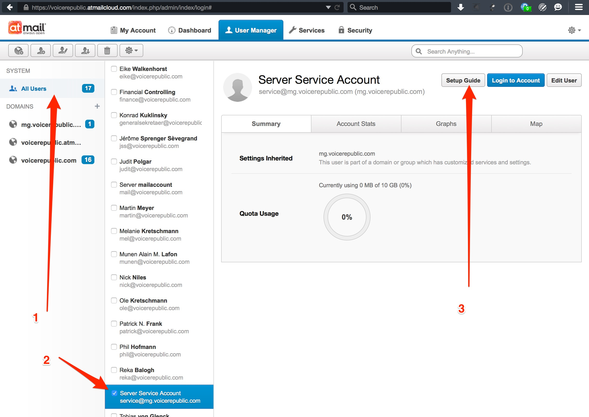

# Mail Setup voicerepublic.com

## Abstract

This file represents the documentation for various mail systems used by
Voicerepublic.

## Marketing

Mailing lists for marketing are created using mailchimp.com

## User/Company/Team Mails

[Atmail](http://atmail.com/) provides us with e-mail(SMTP/IMAP),
calendar(CalDAV) and contact(CardDAV) services which are used for our company
accounts.

### Creating new users

When creating a new user, setup instructions for this new user can be found
here:

### Webmail

Webmail is hosted here: http://webmail.voicerepublic.com/

### General

DNS configuration for Atmail is done on Hetzner:
  https://robot.your-server.de/dns

## System Mails

Automated or server-sent emails are generally sent using
[mailgun](https://mailgun.com/app/domains/mg.voicerepublic.com)

Since we already have DNS MX entries for Atmail on voicerepublic.com, we're
using the subdomain mg.voicerepublic.com for system mails. For maximum
deliverability we have SPF and DKIM DNS entries (managable through Hetzner).

The user through which these mails are sent is postmaster@mg.voicerepublic.com
- this user is configured through Atmail and sends copies of mails sent to it
to tech@voicerepublic.com.

### Rails

Our Rails application uses the HTTP API of mailgun.com through the
mailgun_rails gem.

Rails sends it's mails with the sender "postmaster@mg.voicerepublic.com", but
the "from" address that will get a reply is "service@voicerepublic.com".

### Monit

Monit sends its mails through the locally installed SMTP daemon which is
Postfix. Postfix uses Mailgun through SMTP as a relay service.

### Unattended Upgrades Debian

Debian has unanttended upgrades enabled and will send mails on problems during
upgrading. These mails through the locally installed SMTP daemon which is
Postfix. Postfix uses Mailgun through SMTP as a relay service.

### Errbit

errbit.voicerepublic.com is our Rails exception notification service. It is
also the exception to our Mailgun.com account since it uses Sendgrid as mail
service.

It is hosted on
[Heroku](https://dashboard.heroku.com/apps/voicerepublic-errbit/resources) and
uses the [Sendgrid plugin](https://sendgrid.com/account/overview) on the free
plan which will let us send 400 mails per day for free. In the last year it has
sent 4500 mails total. Therefore the free quota should be enough for the time
being.

Authentication and configuration of Sendgrid can be done starting from the
Heroku dashboard.
