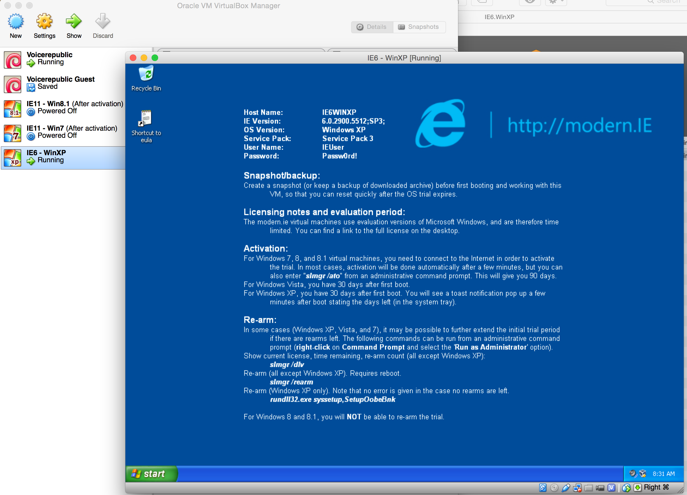

# Testing

## Abstract

This guide is about configuring a setup which is suitable for testing the
voicerepublic.com platform.

Currently (03/2015) we support the following browsers:

 * Google Chrome >= 30
 * Safari >= 7
 * Internet Explorer >= 10
 * Firefox >= 24

Also we support OS X, Windows and Linux. This makes for 9 sensible browser/OS
combinations.

When releasing new major features, it is prudent to test these and potentially
all other major features of the platform in all browsers and Operating
systems(OS).

As for priority concerning OS and browser during testing, please refer to the
currently most used version of either one on
[ga.statcounter.com](http://gs.statcounter.com). Please make sure to use the
region "Switzerland" and "Germany" since these kinds of stats differ widely
across countries.

## Technical Requirements

To be able to test in all browser/OS combinations it is required to first of
all have access to the different types of OS that we support. So that the
tester does not need three different machines for Windows, Linux and OS X,
virtual instances of the respective OS can be used; these can be run in so
called Virtual Machines. Virtual Machines enable you to run different types of
computer configurations with different kinds of operating systems on your local
machine.

Running Linux and Windows can be done from any kind of OS. OS X cannot be
virtualised as easily. Therefore a Mac is required to test browsers in OS X.

To run a Virtual Machine next to your Mac, you need hardware that is powerful
enough to do so. Primarily RAM is a concern, you should have at least 8GB of
it. A current MacBook Pro is the recommended test machine.

## Installation of VirtualBox

A good and free product that manages Virtual Machines on your computer is
Virtualbox.

To install VirtualBox, please visit [virtualbox.org](https://www.virtualbox.org/), go to downloads and follow the steps required by your OS.

## Installation of Windows Virtual Machine

Windows bundles with specific versions of Internet Explorer(IE). That makes it
tedious to test different versions of IE; meaning if you want to test different
versions of IE, you will have to run multiple versions of Windows.

Fortunately Micrsofort supplies us with Virtual Machines readily configured for
testing in exactly this kind of scenario. To install such a Virtual machine,
follow these steps:

 1. Visit [modern.ie](https://www.modern.ie/en-us)
 1. Click on "Virtual Machines" and select a Virtual Machine with appropriate
    IE version (for example "IE11 on Win7")
 1. Select "VirtualBox for Mac" as Platform
 1. Download the Virtual Machine
 1. Unpack it

    \begin{figure}[ht]
    \centering
    \includegraphics{images/windows_download_finished.png}%
    \caption{Unpacked Windows Virtual Machine}%
    \end{figure}

 1. Double click the .ova file

    \begin{figure}[ht]
    \centering
    \includegraphics{images/windows_import_vm.png}%
    \caption{Application Settings}%
    \end{figure}

 1. Import the Windows Virtual Machine
 

    
    Figure 3: Windows Running

### Installation of Firefox

Visit [mozilla.org](https://www.mozilla.org/en-US/firefox/new/) and follow the
required steps.

### Installation of Chrome

Visit
[google.com/chrome/](https://www.google.com/chrome/browser/desktop/index.html)
and follow the required steps.

## Installation of Linux Virtual Machine

For ease of use, it is recommended to use Ubuntu as a Linux testing machine.
A Ubuntu VirtualBox image can be downloaded on
[virtualboxes.org](http://virtualboxes.org/images/ubuntu/). Download a version
that has a Windowmanager that is familiar to you. If you do not know any Linux
Windowmanagers, use GNOME, which is pretty self explainatory.

### Installation of Linux Virtual Machine

This is similar to installing a Windows Virtual Machine, so please refer to the
explanation above.

The screenshots below have been taken with Ubuntu 13.04x86

### Installation of Firefox

Firefox comes pre-installed with Ubuntu usually, but it can be a very old
version. For upgrading, please refer to the
[manual](https://help.ubuntu.com/community/FirefoxNewVersion).

### Installation of Google Chrome

For installing Chrome, please refer to the
[documentation](voicerepublic_public/VR_CI_Paket/_Fonts/Desktop).
