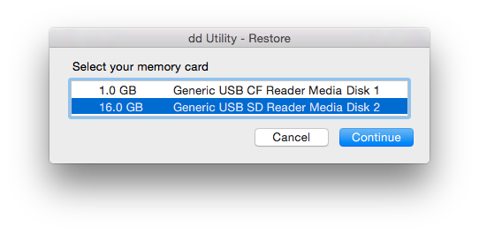

# How to build the streambox

## Write image to microSD card
First you need the image. Download it here:
https://staging.voicerepublic.com/system/streambox.img.gz

Then, follow the instructions for your operating system below. (Large parts of this are taken pretty much unchanged from the guides on https://www.raspberrypi.org/documentation/installation/installing-images/)

### Linux
Under Linux, there are some GUI tools to accomplish what we want, but we all know that any self-respecting Linux user would scoff at the thought of using a GUI tool where a simple shell command can do the trick ;)

Of course, we also know that it seldomly actually **is** just a simple shell command...
**Be wary! Using `dd` could delete all data on your computer. Be sure to check and double check your command/the target device before executing it!**

Identify your microSD card:
- run `df -h`

- Insert the microSD card into your computers cardreader (using an adapter if necessary).

- run `df -h` again. The new device that has appeared is your SD card. The left column gives the device name of your SD card; it will be listed as something like /dev/mmcblk0p1 or /dev/sdd1. The last part (p1 or 1 respectively) is the partition number but you want to write to the whole SD card, not just one partition. You therefore need to remove that part from the name, getting, for example, /dev/mmcblk0 or /dev/sdd as the device name for the whole SD card. Note that the SD card can show up more than once in the output of df; it will do this if you have previously written a Raspberry Pi image to this SD card, because the Raspberry Pi SD images have more than one partition.

- Now that you've noted what the device name is, you need to unmount it so that files can't be read or written to the SD card while you are copying over the SD image.

- Run umount /dev/sdd1, replacing sdd1 with whatever your SD card's device name is (including the partition number).

- If your SD card shows up more than once in the output of df due to having multiple partitions on the SD card, you should unmount all of these partitions.

- In the terminal, write the image to the card with the command below, making sure you replace the input file if= argument with the path to your .img file, and the /dev/sdd in the output file of= argument with the right device name. This is very important, as you will lose all data on the hard drive if you provide the wrong device name. Make sure the device name is the name of the whole SD card as described above, not just a partition of it; for example, sdd, not sdds1 or sddp1, and mmcblk0, not mmcblk0p1.

      dd bs=32M if=streambox.img of=/dev/sdd status=progress

  Please note that block size (bs) set to 32M will work most of the time; if not, please try 16M, then 8M, 4M or 1M in that order, although this will take considerably longer.

- Also note that if you are not logged in as root you will need to prefix this with sudo.

- **For dd versions older than GNU Coreutils 8.24+:** Omit `status=progress` from the command above. The dd command does not give any information of its progress and so may appear to have frozen; it could take more than five minutes to finish writing to the card. If your card reader has an LED it may blink during the write process. To see the progress of the copy operation you can run pkill -USR1 -n -x dd in another terminal, prefixed with sudo if you are not logged in as root. The progress will be displayed in the original window and not the window with the pkill command; it may not display immediately, due to buffering.

- **If your image file is in .gz format:** Either unpack the image file and then just follow the guide above or add `gunzip filename.img.gz |` to the `dd`-command, omitting the `if`-option.

### macOS
Since Mac Users are used to getting both great GUI tools as well as the power of the shell, we will discuss both approaches here.

#### dd-utility
*For the record, this utility also exists as a debian package, available in the same github repository.*

- Download the [dd-utility](https://github.com/thefanclub/dd-utility/raw/master/DMG/ddUtility-1.8.dmg) and move the contained application to wherever you want to run it from (probably /Applications or ~/Applications).

- Start dd Utility from wherever you put it.

- *NOTE: You can also Drag and Drop a image file on the dd Utility app icon to restore.*

- You will be asked to enter your password to start the process. Administrator rights are needed to write the image file to the memory card.

- Select **Restore** in the main dialog

- Select the IMG or ISO file you would like to restore/write to your memory card or disk. Supported file formats include .img, .iso, .zip, .gz and .xz

- Select your memory card from the list. No need to format the card.

- Confirm the settings and click Start to begin the process of writing the image file to the memory card. *NOTE: All data on the memory card will be overwritten and replaced by the image file data.*

- Once the process has started, it can take minutes to hours depending on the size of the image files, the speed of the memory card and compression used. Be patient and wait for the process to complete.

- You did it!

#### Shell
This is very close to the process used in Linux. There are two key differences though:

First, you also will use the `dd`-command, though it has a slightly different syntax:

    dd if=streambox.img of=/dev/rdisk3 bs=32m

Did you spot the difference? The `m` in the `bs`-option is lowercase, instead of uppercase as in Linux. Also, no progress display. You can use the trick with the interrupt to display current progress, though (see Linux). Or just press `CTRL+T`.
*It might be easier to just install gnu coreutils and use its dd, since it is a lot more up to date than the version Apple provides.*

Second, you should use diskutil for all operations concerning disks and filesystem.

Use `diskutil list` to display all currently connected disks. Usually, you can identify SD cards quite easily. Now, the disk will be called something like `/dev/disk3`. The number can be something else though. Now for use with dd you want to prefix that `disk` with an `r`, like so: `/dev/rdisk3`. This means `dd` will use the raw disk and be considerably faster in reading and writing. Make sure you use the right number after the disk, because as it was in Linux, you can delete all data on your computer if you make a wrong move here.

Before you write to the disk, unmount it with `diskutil unmountDisk disk3`.

And remember to eject the card (in Finder or using `diskutil eject disk3`) before physically removing it. macOS will scold you otherwise.

### Windows
Now, as anyone who ever had the misfortune to open a command line on windows (yes, PowerShell is a lot better, but still far away from redemption) will know, its mere mention sends shivers down your back and makes you want to run away as fast and far as you can. Therefore, I will not even talk about it. So here is how to do it the Windows way.

- Insert the SD card into your SD card reader and check which drive letter was assigned. You can easily see the drive letter, such as G:, by looking in the left column of Windows Explorer. You can use the SD card slot if you have one, or a cheap SD adapter in a USB port.

- Download the Win32DiskImager utility from the Sourceforge Project page as a zip file; you can run this from a USB drive.

- Extract the executable from the zip file and run the Win32DiskImager utility; you may need to run this as administrator. Right-click on the file, and select Run as administrator.
- Select the image file you extracted earlier.

- Select the drive letter of the SD card in the device box. Be careful to select the correct drive; if you get the wrong one you can destroy the data on your computer's hard disk! If you are using an SD card slot in your computer and can't see the drive in the Win32DiskImager window, try using an external SD adapter.

- Click Write and wait for the write to complete.

- Exit the imager and eject the SD card.

## Installing the heatsinks

There are two heatsinks with pre-applied glue, one a bit bigger than the other. There are also two chips which the heatsinks pretty much perfectly fit. Remove the protective film from the heatsinks and stick them onto their matching chip. Voilà, heatsinks installed.

## Encasing the Pi
